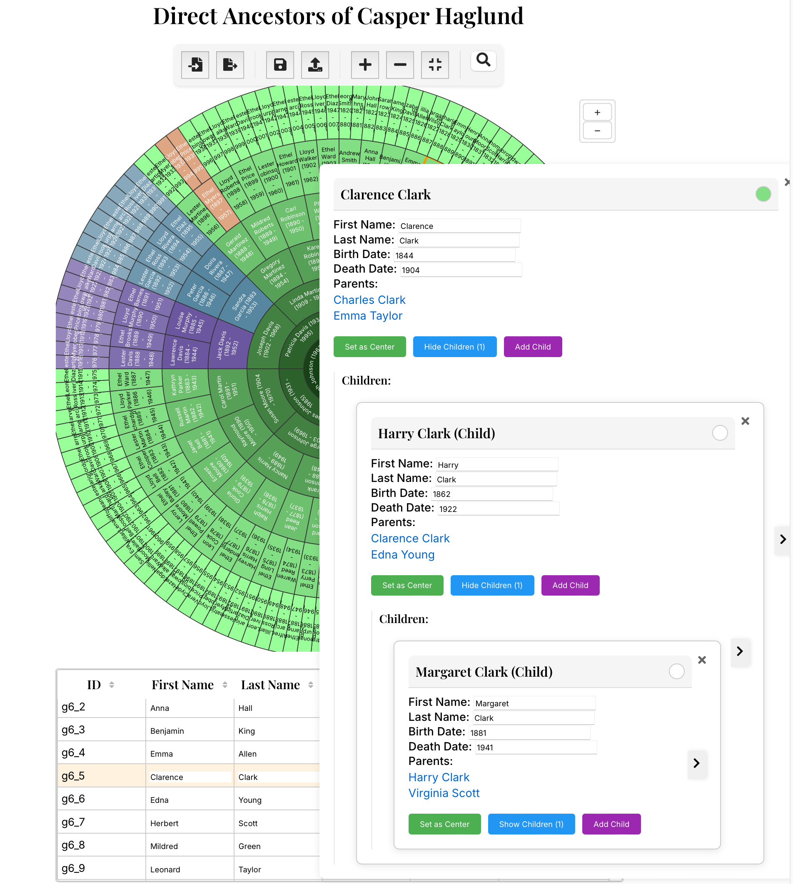

# Genealogy Chart Visualization

An interactive genealogy visualization tool built with React and D3.js that displays family relationships in a circular chart format.



## Features

- Interactive circular family tree visualization
- Generates test data for up to 8 generations of ancestors
- GEDCOM import/export functionality
- JSON file and localStorage persistence options
- In-place editing of person details
- Dynamic addition of family members
- Ability to set any person as the center of the chart
- Responsive design with nested editing forms
- Tabular view of all family members

## Getting Started

### Prerequisites

- Node.js (v14 or higher)
- npm or yarn

### Installation

1. Clone the repository:

```bash
git clone https://github.com/rysweet/genealogyChartExp.git
cd genealogyChartExp/my_genealogy_app
```

2. Install dependencies:

```bash
npm install
# or
yarn install
```

3. Start the development server:

```bash
npm start
# or
yarn start
```

4. Open [http://localhost:3000](http://localhost:3000) to view it in your browser.

## Usage

- Click on any segment in the chart to edit that person's details
- Use "Set as Center" to recenter the chart on a different person
- Import/Export GEDCOM files using the controls at the top
- Save/Load your family tree data as JSON
- Add new generations using the "+ Generation" button
- Edit person details directly in the table view
- Use the nested form view to manage parent-child relationships

## Data Persistence

The app supports two types of data persistence:

1. JSON File Storage:
   - Save your family tree to a local JSON file
   - Load family tree data from saved JSON files

2. LocalStorage:
   - Automatically save to browser's localStorage
   - Persist data between sessions

## Technologies Used

- React
- D3.js
- JavaScript/ES6+
- HTML5/CSS3
- File System Access API

## Project Structure

```
my-genealogy-app/
├── src/
│   ├── components/
│   │   ├── GenealogyChart.jsx
│   │   ├── PersonEditForm.jsx
│   │   ├── PeopleTable.jsx
│   │   └── Controls.jsx
│   ├── persistence/
│   │   ├── PersistenceLayer.js
│   │   ├── JsonFilePersistence.js
│   │   └── LocalStoragePersistence.js
│   ├── gedcom/
│   │   ├── importGedcom.js
│   │   └── exportGedcom.js
│   ├── data/
│   │   └── sampleData.json
│   └── App.jsx
└── public/
```

## Contributing

Contributions are welcome! Please feel free to submit a Pull Request.

## License

This project is licensed under the MIT License - see the LICENSE file for details.
